# ⚙️ Complete Setup Guide – pfSense + Suricata SOC Lab

## 📌 Overview
This guide explains how to build a complete SOC lab from scratch using pfSense firewall and Suricata IDS/IPS, including installation, configuration, and attack simulation.

---

## 🧰 Requirements

- VirtualBox / VMware  
- Minimum 8 GB RAM  
- Stable internet connection  

---

## 💿 Step 1: Download Required Files

### 🔹 pfSense ISO
1. Go to: https://www.pfsense.org/download/  
2. Select:
   - Architecture → AMD64  
   - Installer → DVD Image (ISO Installer)  
   - Console → VGA  
3. Click Download  

---

### 🔹 Kali Linux
1. Go to: https://www.kali.org/get-kali/  
2. Download Installer ISO  

---

### 🔹 Metasploitable2
1. Go to: https://sourceforge.net/projects/metasploitable/  
2. Download VM  

---

## 🖥️ Step 2: Install Virtualization Software

Install VirtualBox or VMware.

---

## 🧱 Step 3: Create pfSense Virtual Machine

- RAM: 2 GB  
- CPU: 2 cores  

### Network Adapters:
- Adapter 1 → NAT (WAN)  
- Adapter 2 → Host-Only (LAN)  
- Adapter 3 → Host-Only (OPT1)  

---

## 🌐 Network Configuration (IP Addressing & Interfaces)

### 🔹 pfSense Interfaces

| Interface | Network Adapter | IP Address | Purpose |
|----------|----------------|-----------|--------|
| WAN | NAT | DHCP | Internet access |
| LAN | Host-Only | 192.168.10.1 | Attacker network |
| OPT1 | Host-Only | 192.168.20.1 | Target network |

---

### 🔹 Kali Linux (Attacker)

| Parameter | Value |
|----------|------|
| Adapter | Host-Only |
| Interface | eth0 |
| IP | 192.168.10.5 |
| Gateway | 192.168.10.1 |

---

### 🔹 Metasploitable2 (Target)

| Parameter | Value |
|----------|------|
| Adapter | Host-Only |
| Interface | eth0 |
| IP | 192.168.20.50 |
| Gateway | 192.168.20.1 |

---

### 🔄 Traffic Flow

Kali → pfSense LAN → pfSense OPT1 → Target  

---

# 🛠️ pfSense Installation Steps

## 📥 Step 4 — Accept License
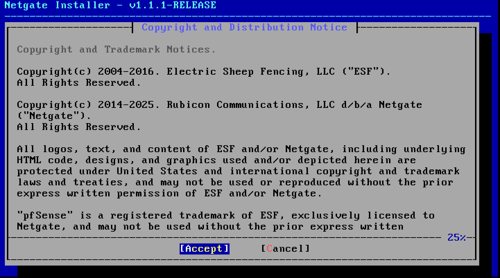

---

## 💻 Step 5 — Install pfSense
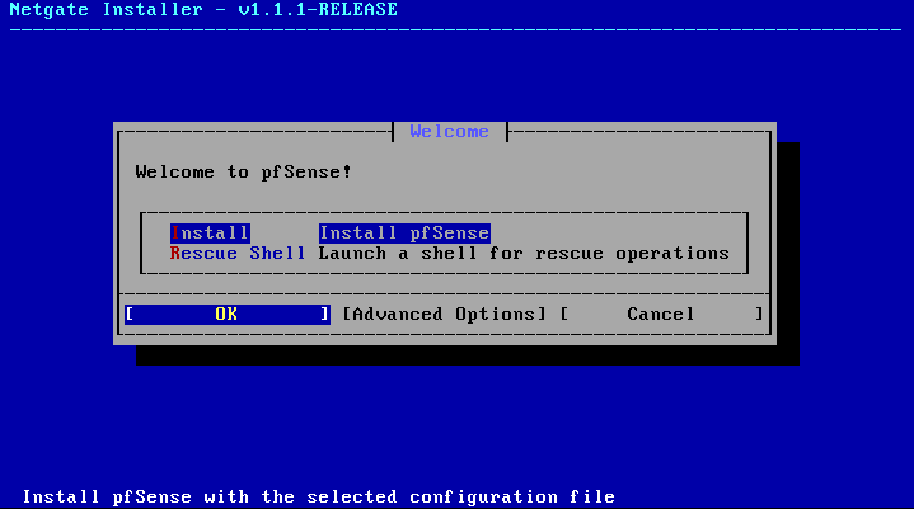

---

## 🌐 Step 6 — Network Init
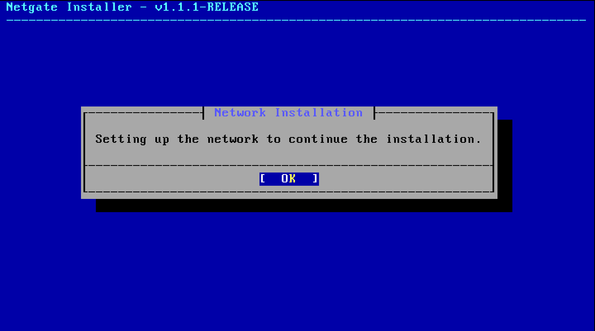

---

## 🌍 Step 7 — Select WAN
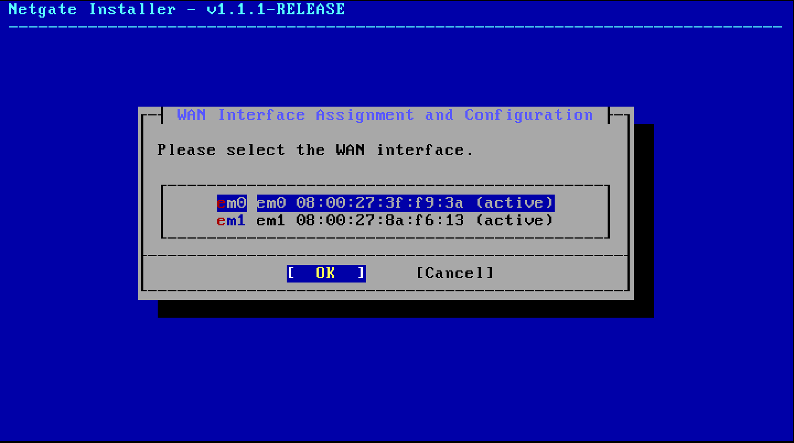

---

## ⚙️ Step 8 — Configure WAN
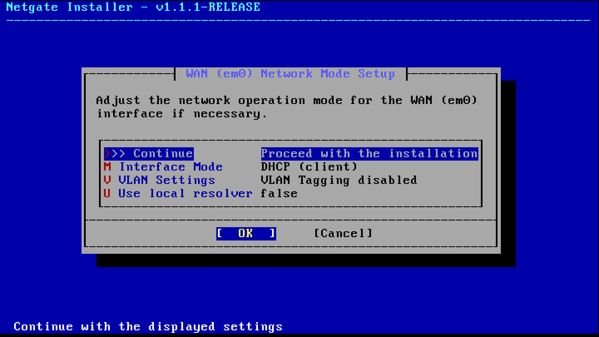

---

## 🖧 Step 9 — Select LAN
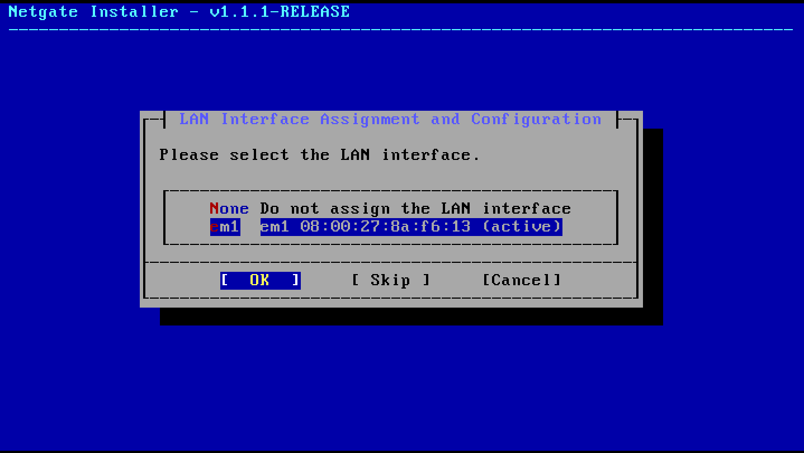

---

## ⚙️ Step 10 — Configure LAN
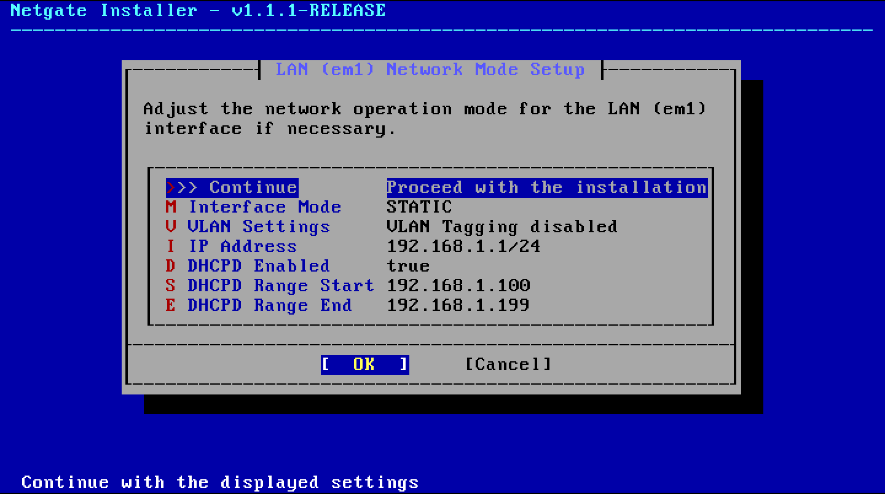

- LAN IP: **192.168.10.1/24**

---

## 🔁 Step 11 — Confirm Interfaces
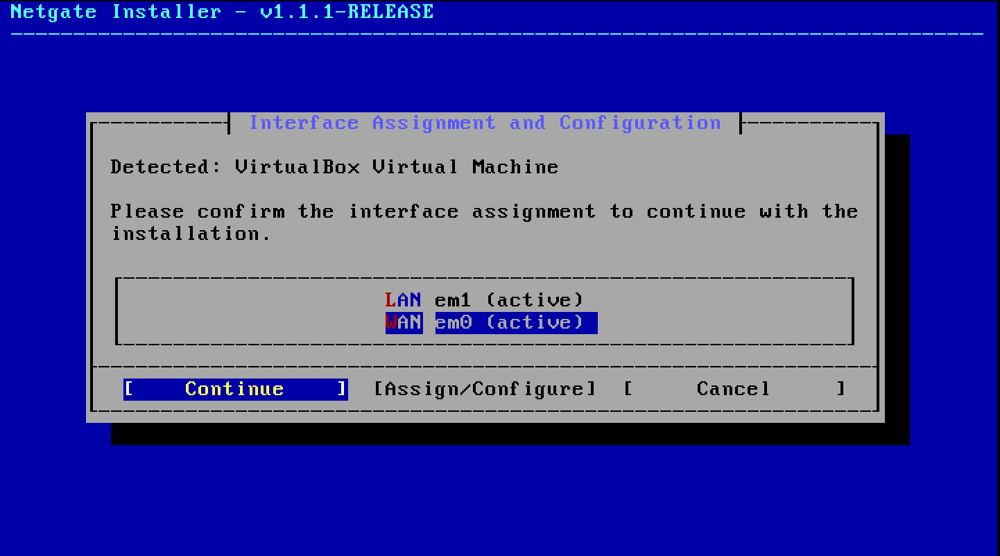

---

## 📦 Step 12 — Install CE
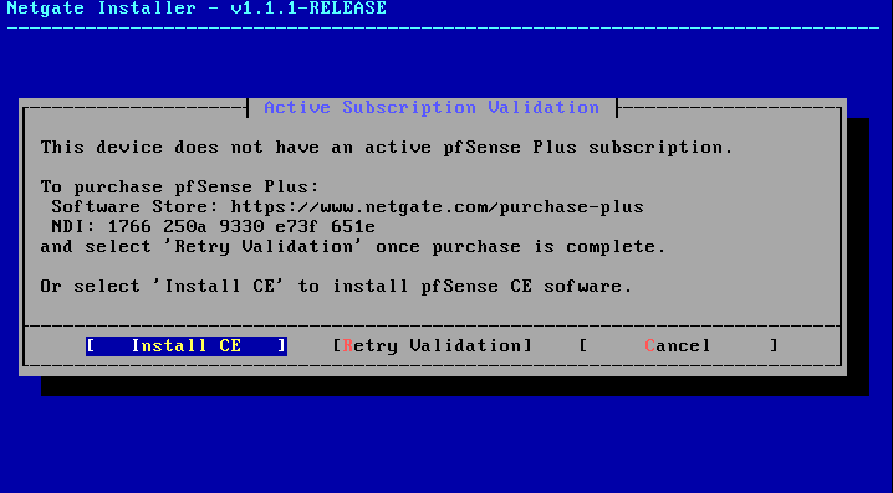

---

## 💾 Step 13 — File System
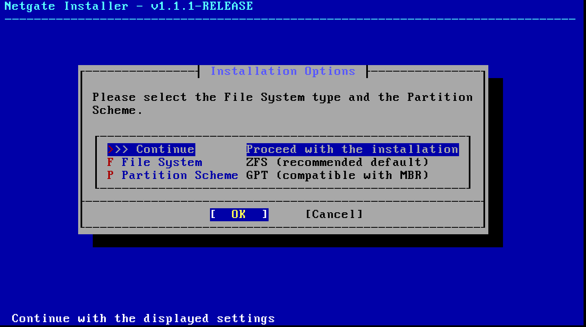

---

## 🧱 Step 14 — ZFS
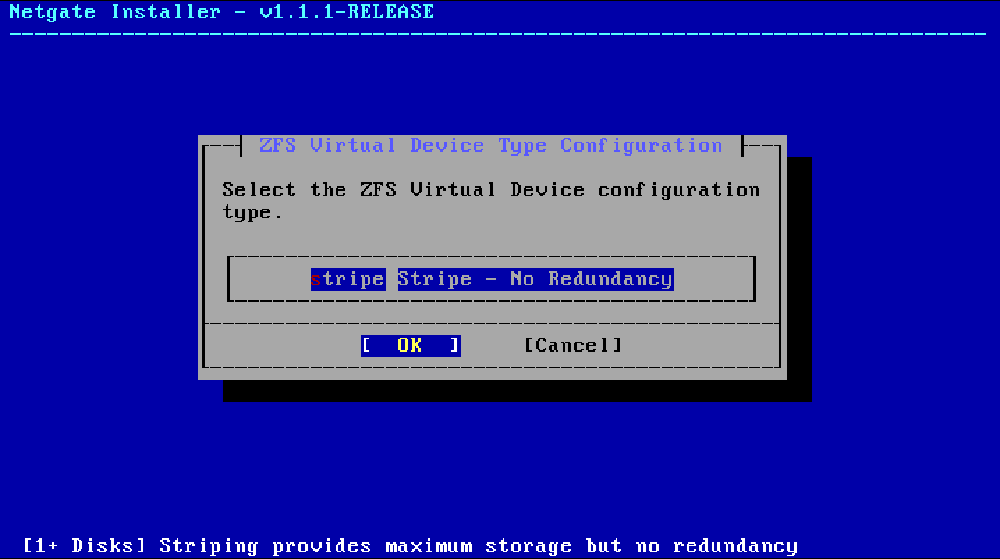

---

## 💽 Step 15 — Disk
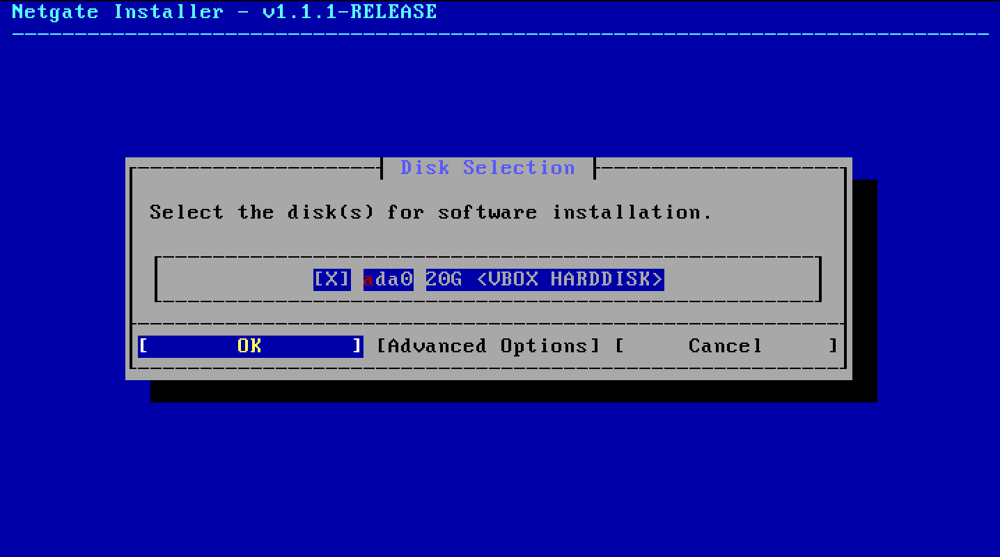

---

## ⚠️ Step 16 — Confirm Disk
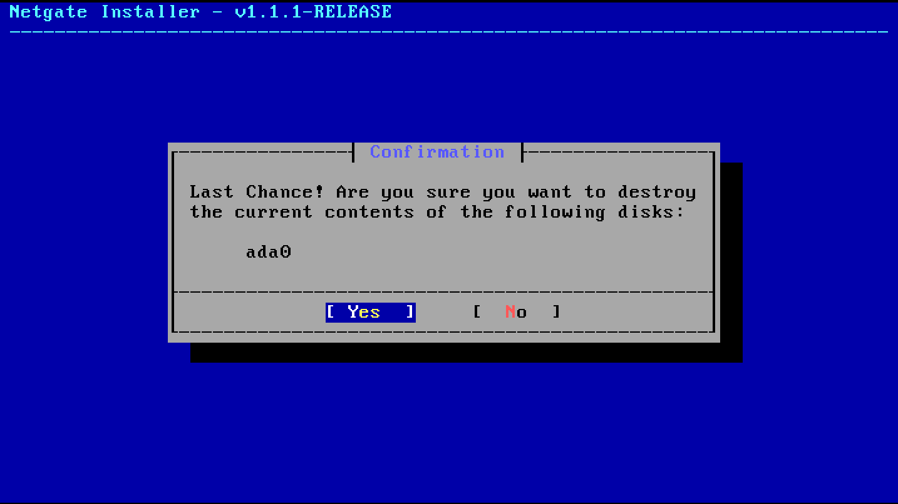

---

## 📌 Step 17 — Version
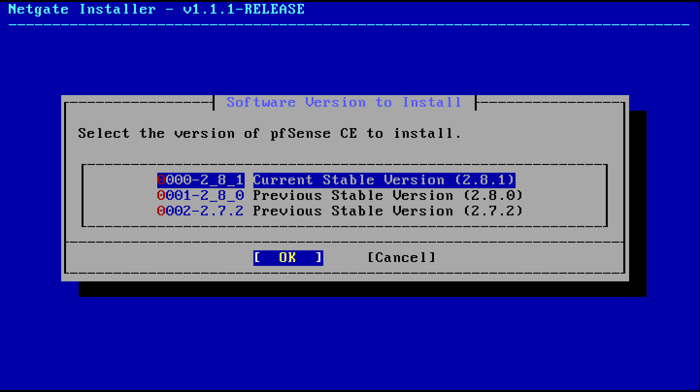

---

## ⚙️ Step 18 — Installing
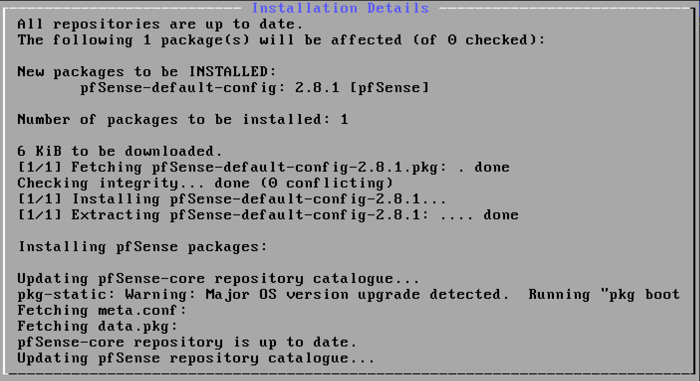

---

## 🔄 Step 19 — Post Install
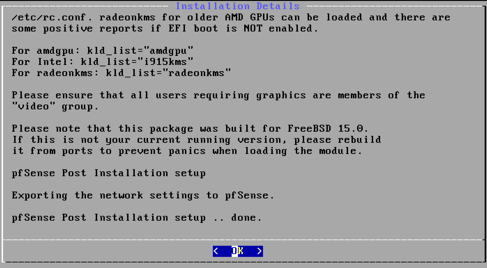

---

## ✅ Step 20 — Reboot
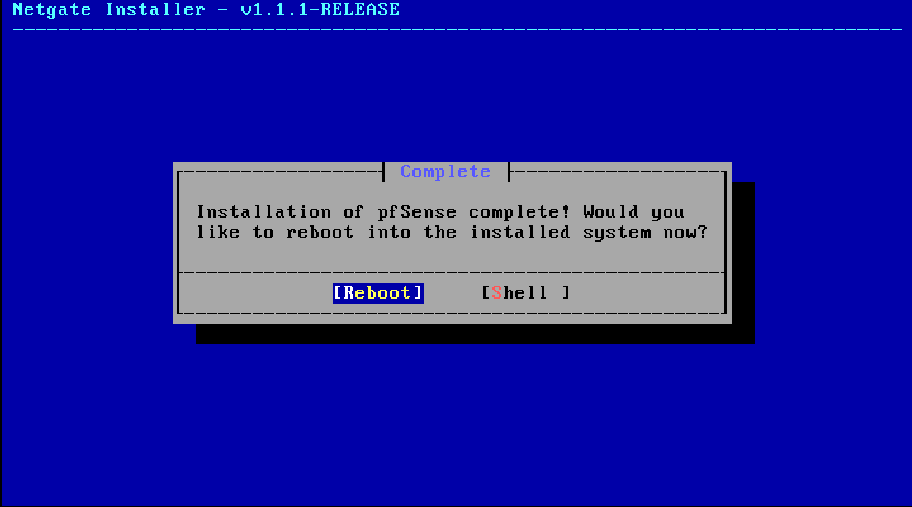

---

## 🖥️ Step 21 — Console
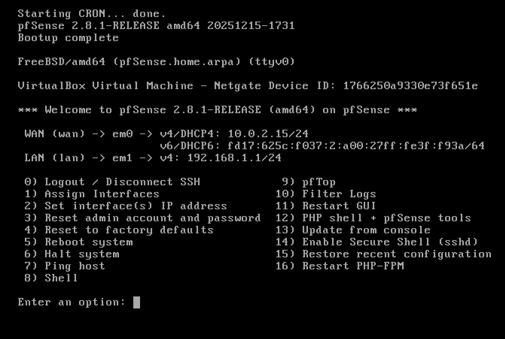

---

## 🔌 Step 22 — Configure OPT1 Interface

1. Select option:
Assign Interfaces

2. Assign third interface (em2) as OPT1  

3. Set IP:

192.168.20.1 /24

---

## 🌐 Step 23 — Access Web Interface

https://192.168.10.1

- Username: admin  
- Password: pfsense  

---

## 🖥️ Step 24 — Setup Kali

ip addr add 192.168.10.5/24 dev eth0  
ip route add default via 192.168.10.1  

---

## 🎯 Step 25 — Setup Metasploitable

ifconfig eth0 192.168.20.50 netmask 255.255.255.0  
route add default gw 192.168.20.1  

---

## 🔄 Step 26 — Test Connectivity

ping 192.168.20.50  

---

## 🔥 Step 27 — Configure Firewall Rule (Block FTP)

🔐 Login  
Open: https://192.168.10.1  

🧭 Navigate  
Firewall → Rules → LAN  

➕ Add Rule  
Click Add (↑ icon)  

⚙️ Configure Rule  
- Action → Block  
- Protocol → TCP  
- Source → Any  
- Destination → Any  
- Destination Port → 21 (FTP)  

💾 Save  
Click Save → Apply Changes  

🎯 Result  
FTP traffic blocked  

🔁 Note  
You can change the destination port (e.g., 22 for SSH, 80 for HTTP, 445 for SMB) based on requirement.  

---

## ⚡ Step 29 — Configure Suricata (IDS → IPS)

🛡️ IDS Setup  

Go to:  
Services → Suricata → Add Interface (OPT1)  

⚙️ Settings  
- Enable → Yes  
- IPS Mode → Disabled  
- Promiscuous Mode → Enabled  

📥 Rules  
- Emerging Threats Open (ET Open)  
- Snort VRT (optional)  

📜 Categories  
- ET SCAN  
- ET EXPLOIT  
- ET POLICY  
- ET TELNET  

👉 You can enable categories based on your requirement.  

---

⚡ IPS Setup  

Go to:  
Services → Suricata → Interfaces → OPT1  

⚙️ Enable IPS  
- IPS Mode → Enabled  

📌 Modes  
- Legacy  
- Inline (Recommended)  

👉 Select Inline Mode  

🛡️ Enable Blocking  
- Block Offenders → Enabled  
- Kill States → Enabled  

💾 Apply Changes  
Save → Apply → Restart Suricata  

---

## 🔍 Step 30 — Nmap Scan

nmap -sV 192.168.20.50  

---

## 💣 Step 31 — Exploitation

msfconsole  
use exploit/unix/ftp/vsftpd_234_backdoor  
run  

---

## 🔐 Step 32 — Brute Force Attack

hydra -l msfadmin -P rockyou.txt telnet://192.168.20.50  

---

## 🛡️ Step 33 — Monitor Alerts

Go to:  
Suricata → Alerts  

---

## 🚫 Step 34 — Validate IPS

Confirm that the attack is blocked and alerts are generated.  

---
